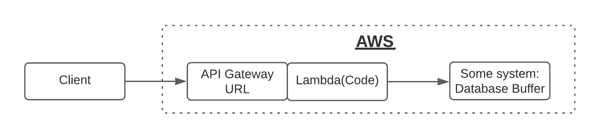
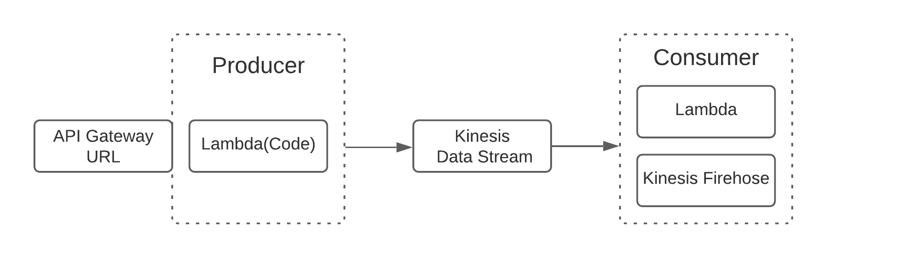
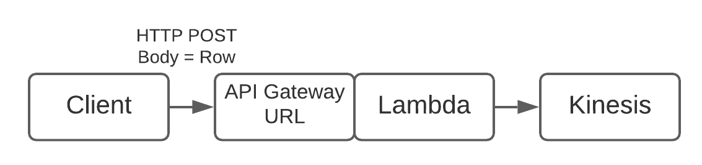
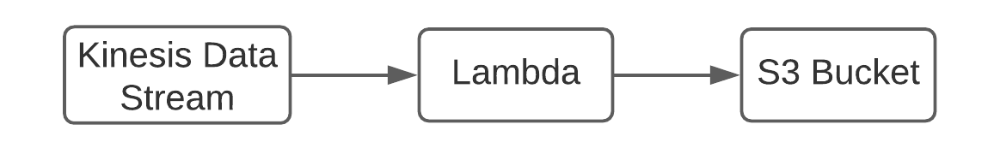
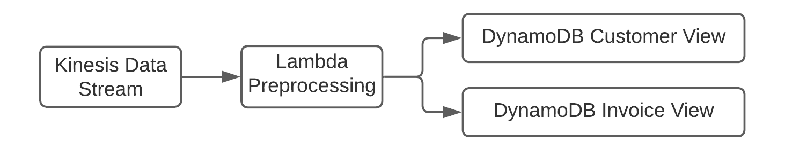
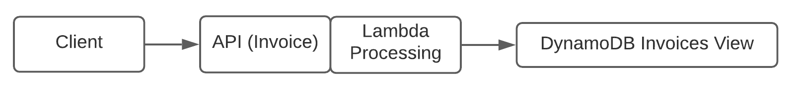
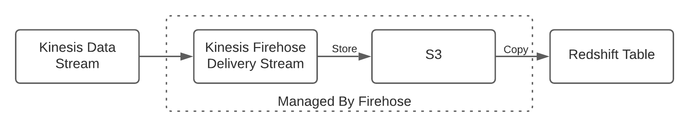
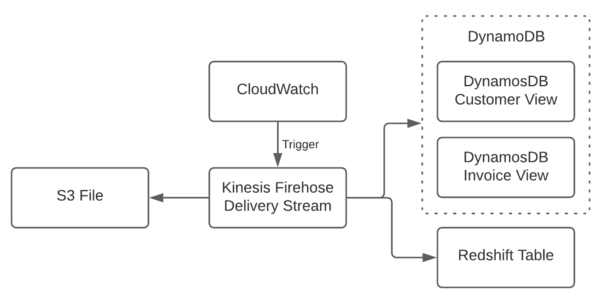

# Data Engineering on AWS

## Platform Design
### Selecting the tools
The following diagram show the tools that will be used on the next project. All them belongs to AWS ecosystem.

### Client
Python will be the language used for scripts.
  - Reads .CSV
  - Possibility to select data e.g from today or "x" number of lines
  - Transforms each line into JSON string

### Connect
- API Gateway
- Lambda

### Buffer
- Kinesis
- Kafka

### Process
- Streaming Processing
  - Lambda Functions with triggers on Source
  - Continuous Process

- Batch Processing
  - Lambda
  - CloudWatch for Scheduling

### Store
- S3 File Storage
- DynamoDB NoSQL
  - Wide Column Store
  - Backend
  - Transactions
- Redshift Data Warehouse
  - Analytics layer
  - Distributed Storage and processing

### Visualize
- APIs
   - Access for Apps, UIs
   - Execute queries and transactions
   - Simple, stateless
- Tableau
   - Business Intelligence Tool
   - Installed on your pc
   - Connects to Redshift
  
  

## Data Pipelines
Diagrams and tools used in the following Pipelines along the project
  

### Data Ingestion Pipeline
- Client
  - Simulates Streaming
  - Sends CSV Rows as JSON
- API-Gateway
- Lambda
- Kinesis

### Stream to Raw Storage Pipeline
- Kinesis inserts triggers Lambda for S3
  - Lambda waits for some time
  - Writes all messages in queue to S3 Bucket as file

### Stream to DynamoDB Pipeline
- Kinesis insert triggers Lambda for DynamoDB
  - Lambda reformats/preprocess messages
  - Lambda writes customer data (customer + invoices)
  - Lambda writes invoice data (invoice + stockcode)

### Visualization API Pipeline
- API for UI (Items in Invoice)
   - Data rests in DynamoDB table invoices
   - Client request Items for InvoiceNo (Request parameter)
   - Lambda triggered by API queries Dynamo with InvoiceNo

### Visualization Redshift Data Warehouse
- Kinesis Firehose Delivery Stream connects to Kinesis Data Stream
- Firehose writes data into intermediate S3 Bucket
- Kinesis Firehose copies data into Redshift table
- Tableau for Analyst access

### Batch Processing Pipeline
- Bulk import Pipeline
- Triggered through Cloudwatch
- Lambda reads from S3 folder
- Writes data into DynamoDB
- Writes into Redshift

---
  

## Data Ingestion Pipeline

### Create Lambda for API
1. Open <ins>Lambda</ins> on AWS
2. Go to Lambda Functions and press "Create Function"
3. Fill the requirements
   - **Function name:** "WriteKinesis"
   - **Runtinme**: Python 3.9
   - **Execution role:** Create a new role with basic Lambda permissions
4. Press *Create Function*

### Create API Gateway
1. Open <ins>API Gateway</ins> on AWS
2. Select "Build" on REST API option
3. Fill the requirements
   - **Select whether you would like to create a REST API or a WebSocket API:** REST
   - **In Amazon API Gateway, a REST API refers to a collection of resources and methods that can be invoked through HTTPS endpoints**: New API
   - **API Name:** "test"  
   - **Endpoint type:** Regional
4. Press *Create API*
5. On actions press "Create Resource"
   - Type on **Resource Name:** "hello"
   - Press *Create Resource*
6. On actions press "Create Method"
   - Create methods for **GET, POST & PUT**
   - All three methods, select the following requirements:
     - **Integration type:** Lambda Function
     - **Lambda Function:** test
7. Press *Save*
8. Select **GET** method
   - Press on "Integration Request"
   - Press on "Mapping templates"
   - **Content-Type:** application/json
   - Press "Yes, secure this integration"
   - **Generate template:** Method Request passthrough.

    Of this way all the content coming through the API is forwarded to Lambda function.

### Setup Kinesis 
1. Open <ins>Kinesis</ins> on AWS
2. Select "Create data stream" on Kinesis Data Stream
3. Fill the requirements
   - **Data Stream name:** "APIdata"
   - **Capacity Mode**: Provisioned
   - Press "Create Data Stream"

### Setup IAM for API
Now, setting up IAM will make sure that Lambda function delivers data into Kinesis.
1. Open <ins>Lambda</ins> on AWS
2. Go to "test" function
3. Press on "Configuration" and then in "Permissions"
4. Inside "Edit" after the "Existing role" press in "View the *rolename*"
5. Go to "Policies" and create a policy
6. Fill the requirements
   - **Service:** Kinesis
   - **Actions:** PutRecord & PutRecords
   - **Resources:** All resources
   - **Name:** "MyKinesisWriteAPIData"
   - Create policy
7. Go to Roles and inside "test-role" add the recently created policy

### Create Ingestion Pipeline (Code)
1. Open <ins>Kinesis</ins> on AWS
2. Select the function "WriteKinesis"
3. Using the code provided in the [link](code/data_ingestion_pipeline/Lambda-Code.py), copy and paste it browser while you replacing the standard code that it is automatically created after creating the function.
*This code connects the client with Kinesis using the API through Lambda.*

### Create Script to Send Data
1. Open <ins>API Gateway</ins> on AWS
2. Stages must be created to access methods, so far the only we can do it is to test them.
3. Go to "Actions" and press on "DeployAPI"
4. Create new stage and name it "P" reference to production stage.
5. Go to P and select method POST
6. Copy the invoke URL and past it in your [URL Endpoint](code/data_ingestion_pipeline/insert_template)

### Test the Pipeline
1. Run the [python file](code/data_ingestion_pipeline/insert_template)
2. Open <ins>CloudWatch</ins> on AWS
3. Inside LogGroups there are the logs printed by the [insert_template.py](code/data_ingestion_pipeline/insert_template) file

  

## Stream to Raw S3 Storage Pipeline

### Setup S3 Bucket
1. Open <ins>S3 Bucket</ins> on AWS
2. Create bucket and name it "my-aws-bucket-2022", leave rest of options as it is.

### Setup IAM for API
Now, setting up IAM will make sure that Lambda function delivers data into S3 Bucket.
1. Open <ins>IAM</ins> on AWS
2. Access to roles
3. Create a new role using Lambda as a common use case
4. Move to next step
5. Create new policies
   - Create myKinesisRead
   - Add S3FullAccess
   - Add Kinesis role
6. Name it "Lambda-Kinesis-S3-Writer"

### Create Lambda for S3 Insert
1. Open <ins>Lambda</ins> on AWS
2. Press on create function
3. Use the blueprint "kinesis-process-record-python"
4. Select in Kinesis stream the option "APIdata"
5. Select for existing role the one previously created
6. Name the function as "writeKinesisS3" and press create function
7. Use the code in [lambda_code_raw_S3.py](code/stream_to_raw_s3_storage_pipeline/lambda_code_raw_S3.py) to set the lambda.
   
  

## Stream to DynamoDB Pipeline

### Setup DynamoDB
1. Open <ins>DynamoDB</ins> on AWS
2. Create a new table
3. Name it "Customer"
4. Do not use default settings
5. In Auto Scaling min and max capacity to 1 unit
6. Create another new table "Invoice" and apply same settings
7. Partition keys must be numbers
   - CustomerID
   - InvoiceNo

### Setup IAM for DynamoDB Stream
1. Open <ins>IAM</ins> on AWS
2. Access to roles
3. Create a new role using Lambda as a common use case
4. Move to next step
5. Create new policies
   - Add the executional role for Lambda
   - Add myKinesisRead
   - Add myDynamoDBWrite
6. Name it "Write-To-DynamoDB-role"

### Create Lambda for S3 Insert
1. Open <ins>Lambda</ins> on AWS
2. Press on create function
3. Use the blueprint "kinesis-process-record-python"
4. Select in Kinesis stream the option "APIdata"
5. Select for existing role the one previously created
6. Name the function as "Write-To-DynamoDB" and press create function
7. Use the code in [lambda_code_dynamodb.py](code/stream_to_dynamodb/lambda_code_dynamodb.py) to set the lambda.

  

## Visualization API
### Create API & Lambda for access
1. Open <ins>API Gateway</ins> on AWS
2. Get sure the GET method is working
3. Go to Lambda functions
4. Open "Lambda-Kinesis-S3-Writer" add GET method to the code.

### Test the API
1. Open <ins>Postman</ins>
2. Create new request
3. Open <ins>API Gateway</ins> on AWS
   1. Enter on stages
   2. Go to GET method and copy Invoke URL
4. Paste the selected url
5. On KEY write "InvoiceNo"
6. On value write "536373"
7. Send request

  

## Visualization Pipeline Redshift Data Warehouse
### Setup Redshift Data Warehouse
1. Open <ins>API Gateway</ins> on AWS
