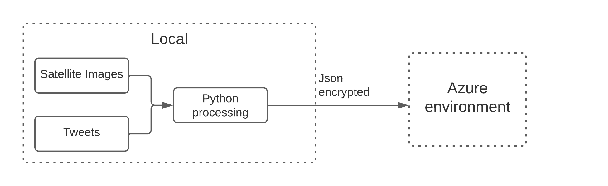

# Data Engineering On Azure

## Hurricane Harvey  Tweets and Satellite Images 
<br>


# Content

- [Data Engineering On Azure](#data-engineering-on-azure)
  - [Hurricane Harvey  Tweets and Satellite Images](#hurricane-harvey--tweets-and-satellite-images)
- [Content](#content)
- [Introduction & Goals](#introduction--goals)
- [Data](#data)
- [Used Tools](#used-tools)
  - [Connect](#connect)
  - [Buffer](#buffer)
  - [Processing](#processing)
  - [Storage](#storage)
  - [Visualization](#visualization)
- [Steps along the project](#steps-along-the-project)
  - [Datasets and Local Preprocessing](#datasets-and-local-preprocessing)
    - [Introduction to Datasets and local preprocessing](#introduction-to-datasets-and-local-preprocessing)
    - [Deploying your code on Visual Studio to Docker containers](#deploying-your-code-on-visual-studio-to-docker-containers)
  - [Azure Functions and Blob Storage](#azure-functions-and-blob-storage)
    - [Develope Azure Functions via Python and VS Code](#develope-azure-functions-via-python-and-vs-code)
    - [Deploy Azure Function to Azure Function App and Test it](#deploy-azure-function-to-azure-function-app-and-test-it)
    - [Integrate Azure Function with Blob Storage via bindings](#integrate-azure-function-with-blob-storage-via-bindings)
  - [Add Azure Function to Azure API management APIM](#add-azure-function-to-azure-api-management-apim)
    - [Expose Azure Function as Backend, and Test it from Insomnia](#expose-azure-function-as-backend-and-test-it-from-insomnia)
    - [Securely Store Secrets in Azure Key Vault and Connect APIM to Key Vault](#securely-store-secrets-in-azure-key-vault-and-connect-apim-to-key-vault)
    - [Add Basic authentication in API Management using Key Vault and Named Values](#add-basic-authentication-in-api-management-using-key-vault-and-named-values)
  - [Create and Combine Event Hubs, Azure Function and Cosmos DB](#create-and-combine-event-hubs-azure-function-and-cosmos-db)
    - [Create Event Hubs and Test Capture Events Feature](#create-event-hubs-and-test-capture-events-feature)
  - [Write Tweets to Cosmos DB (Core SQL) from Event Hub](#write-tweets-to-cosmos-db-core-sql-from-event-hub)
    - [Create a Cosmos DB (Core SQL) and Create a New Azure Function that writes Messages to Cosmos DB](#create-a-cosmos-db-core-sql-and-create-a-new-azure-function-that-writes-messages-to-cosmos-db)
  - [Connect Power BI Desktop to your Cosmos DB](#connect-power-bi-desktop-to-your-cosmos-db)
    - [Connect Power Bi Desktop via Connector, and create a dashboard](#connect-power-bi-desktop-via-connector-and-create-a-dashboard)

# Introduction & Goals

**Main goals:**
>> Engineer data streaming pipeline on Azure with a main purpose to ingest and process tweets and satellite images data from Hurricane Harvey natural disaster, and serve Power BI report.

This is a meta repository that contains documentation and links to two sub-folders in this repository, each of them having a distinct purpose:

  1) [hurricane-proc-send-data](https://github.com/team-data-science/azure-data-engineering/tree/main/hurricane-proc-send-data/../../../../../../../hurricane-proc-send-data/README.md). Pre-processing of tweets about the hurricane harvey events, combining it with satellite images of the building s with and without damage and simulating a streaming data source by building a python program that sends requests to a Azure API endpoint (#TODO fire CLI)
  
  2) [hurricane-streaming-az-funcs](https://github.com/team-data-science/azure-data-engineering/tree/main/azure-func-demo) Azure data streaming pipeline that:
        - Ingests tweets from the local source client via Azure API management having a Azure Function as backend
        - Utilizes Azure Event Hub as a message queue service
        - Azure Function that takes messages from Azure Event Hub and writes them to Azure Cosmos Database

<br>

**Tools:**

- **Local:**
  - [WSL2 with Ubuntu 20.10](https://docs.microsoft.com/en-us/windows/wsl/install-win10)
    - as operating system for local development
  
  - [Visual Studio Code](https://code.visualstudio.com/) with plugins for Azure Services
    - local development and deployment do Azure (Azure Functions, Azure Web App)

  - Python and its libraries - Pandas, Requests 
    - data processing, and sending https requests to Azure API management

  - Azure SDK's 
    - for relevant Azure Services in Streamlit App use case - [azure-cosmos](https://pypi.org/project/azure-cosmos/)

  - Power BI 
    -  visualization of data from Azure Cosmos DB

- **Azure:**

  - [Azure API Management](https://docs.microsoft.com/en-us/azure/api-management/api-management-key-concepts)

  - [Azure Event Hubs](https://docs.microsoft.com/en-us/azure/event-hubs/event-hubs-about)

  - [Azure Function](https://docs.microsoft.com/en-us/azure/azure-functions/functions-overview)

  - [Azure Cosmos DB](https://docs.microsoft.com/en-us/azure/cosmos-db/introduction) - SQL Core - Document Store

  - [Azure Blob Storage](https://docs.microsoft.com/en-us/azure/storage/blobs/storage-blobs-introduction) 


# Data

1) [Hurricane Harvey Tweets](https://www.kaggle.com/dan195/hurricaneharvey) from Kaggle.

Tweets containing Hurricane Harvey from the morning of 8/25/2017. I hope to keep this updated if computer problems do not persist.

*8/30 Update
This update includes the most recent tweets tagged "Tropical Storm Harvey", which spans from 8/20 to 8/30 as well as the properly merged version of dataset including Tweets from when Harvey before it was downgraded back to a tropical storm.

1) [Satellite Images of Hurricane Damage](https://www.kaggle.com/kmader/satellite-images-of-hurricane-damage) from Kaggle.

Overview
The data are satellite images from Texas after Hurricane Harvey divided into two groups (damage and no_damage). The goal is to make a model which can automatically identify if a given region is likely to contain flooding damage.

Source
Data originally taken from: https://ieee-dataport.org/open-access/detecting-damaged-buildings-post-hurricane-satellite-imagery-based-customized and can be cited with http://dx.doi.org/10.21227/sdad-1e56 and the original paper is here: https://arxiv.org/abs/1807.01688

<br>

# Used Tools
## Connect

- [Azure API Management](https://docs.microsoft.com/en-us/azure/api-management/api-management-key-concepts)
  >> API Management (APIM) is a way to create consistent and modern API gateways for existing back-end services.
  
## Buffer

- [Azure Event Hubs](https://docs.microsoft.com/en-us/azure/event-hubs/event-hubs-about)
  >> Azure Event Hubs is a big data streaming platform and event ingestion service. It can receive and process millions of events per second. Data sent to an event hub can be transformed and stored by using any real-time analytics provider or batching/storage adapters.

## Processing

- [Azure Function](https://docs.microsoft.com/en-us/azure/azure-functions/functions-overview)
  >> Azure Functions is a serverless solution that allows you to write less code, maintain less infrastructure, and save on costs. Instead of worrying about deploying and maintaining servers, the cloud infrastructure provides all the up-to-date resources needed to keep your applications running.

## Storage

- [Azure Blob Storage](https://docs.microsoft.com/en-us/azure/storage/blobs/storage-blobs-introduction) 
  >> Azure Blob storage is Microsoft's object storage solution for the cloud. Blob storage is optimized for storing massive amounts of unstructured data. Unstructured data is data that doesn't adhere to a particular data model or definition, such as text or binary data.

- [Azure Cosmos DB](https://docs.microsoft.com/en-us/azure/cosmos-db/introduction) - SQL Core - Document Store
  >> Azure Cosmos DB is a fully managed NoSQL database for modern app development. Single-digit millisecond response times, and automatic and instant scalability, guarantee speed at any scale. Business continuity is assured with SLA-backed availability and enterprise-grade security.

## Visualization

- [Power BI Desktop Report](https://powerbi.microsoft.com/en-us/desktop/)
  >> Rich, interactive reports with visual analytics.

<br>

# Steps along the project
## Datasets and Local Preprocessing
### Introduction to Datasets and local preprocessing
The two datasets described on [data](#data) since there is no apparent real relation in the data between tweets and satellite images, for this project, the relation between them will be mock and randomly assigned ids from images to tweets to create an artificial relationship.  
<br>

<br>

The goal in this step is to create a single JSON file that contains messages, where each object in the JSON array is merged between tweets and images.  
Once it is done, a python script will send objects in JSON as messages via HTTP requests to Azure API Management API endpoint, emulating source of streaming data.  

### Deploying your code on Visual Studio to Docker containers
- Develop Azure Functions in Python
   - Includes Python3, Azure Functions SDK, Docker CLI
- Prerequisites to use this feature:
  - Install Docker and Docker Compose
  - Install Visual Studio Code
  - Install the Remote - Container extension
  - Install [Azure Functions container](https://hub.docker.com/_/microsoft-azure-functions-python)  

<br>
  
1. Open visual studio and lets add definition
2. Press F1
3. Type "Remote Containers..." and select Remote-Containers: Add Development Container Configuration Files...
4. Select Azure Functions & Python 3
5. Press F1
6. Search and select "Reopen in a Container"
7. Press F1
8. Search and select "Azure Functions: Create Function..."
9. Create new project
   1.  Language "Python"
   2.  Select virtual environment from container
   3.  Select HTTP trigger
   4.  Name it as "-HttpTrigger1"
   5.  Authorization level "Anonymous"
10. Press F5 to run and debug application
11. Use [insomnia](https://insomnia.rest) to test the function
    - For example, name - Pablo
    - If all is okay it will send back "Hello, Pablo. This HTTP triggered function executed successfully."

<br>

## Azure Functions and Blob Storage
### Develope Azure Functions via Python and VS Code
1. Press F1
2. Search and select "Azure Functions: Create Function..."
3. Create new project
   1.  Language "Python"
   2.  Select virtual environment from container
   3.  Select HTTP trigger
   4.  Name it as "HttpTriggerTweetsToBlobAndEventHub"
   5.  Authorization level "Anonymous"
4. Modify and adapt [__init__.py](azure-function/HttpTriggerTweetsToBlobAndEventHub/__init__.py) (Ingests body of http request + Validates JSON message from the body against predefined JSON schema) 
```
# Return value: Set the name property in function.json to $return.
# With this configuration, the function's return value is persisted as an Event Hub message.

# Imperative: Pass a value to the set method of the parameter declared as an Out type.
# The value passed to set is persisted as an Event Hub message.
```

### Deploy Azure Function to Azure Function App and Test it
1. Got to Azure VSC plugin
2. In Functions click on cloud icon(Deploy to Function App...)
3. Press "Create new Function App in Azure...
4. Name it "noreur-dev-dataeng-FA"
5. Select North Europe
6. Consumption plan
7. Create New Storage Account and name it "noreurdevtadaengconfig"
8. Create new Application Insight resource and name it "noreurdevdataengain"
9. Wait until it is deploy it
10. Go to Azure Function App inside the recently created Function
11. Again inside Function and there will be a Developer dashboard with metrics where it is possible to control the timing and logs.

### Integrate Azure Function with Blob Storage via bindings
1. Press F1
2. Select Azure Functions: Add binding...
3. Select existing Function
4. Binding action "out"
5. Name the binding "outputBlob"
6. Name the container tweets/(rand-guid).json
7. Create a new Storage account "tweetssa"
8. Select same group as previous deployment

<br>

## Add Azure Function to Azure API management APIM
### Expose Azure Function as Backend, and Test it from Insomnia
1. Activate the Function that it was previously created.
2. Go to APIs and then from "Create from Azure resource" select "Function App"
3. Browse and select our Function App "noreur-dev-dataeng-FA"
4. Press create
5. Test the API
   1. Copy the body from [mock_api_request file](mock_api_request.json) and past it on "Request Body"
   2. Send it
   3. HTTP response -> "200 - OK"
6. Copy all the HTTP request
7. Open Insomnia and create a new request
8. Select JSON and past the request
9. From the body copy the url from POST
10. Paste it in on top bar of Insomnia post
11. Remove from JSON body all not related to JSON
12. Go to Header
13. Fill host and subscription key from API
14. Send it (200 OK - "This HTTP triggered function executed successfully)

### Securely Store Secrets in Azure Key Vault and Connect APIM to Key Vault
1. Go to our resource group
2. Add from marketplace "Key Vault"
3. Create a key vault
4. Name it "noreur-dev-dataeng-kv"
5. Select region from North Europe
6. Press on Review-Create
7. Go to APIM, inside Security select Managed identities and active it
8. On key vault, go to setting and select Secrets
9. Generate a new one
   1. Upload options - Manual
   2. Name - password-apim
   3. Value - **********
   4. Create
10. Create another secret
    1. Upload options - Manual
   2. Name - username
   3. Value - **********
   4. Create 
11. Move to ""noreur-dev-dataeng-APIM"
12. Under APIs select "Named values"
13. Create a new value
    1.  Name - username
    2.  Displayname - username
    3.  Type - Key vault
    4.  Secret - Select username
    5.  Save
14. Create anoter new value
    1.  Name - password
    2.  Displayname - password
    3.  Type - Key vault
    4.  Secret - Select password-apim
    5.  Save

### Add Basic authentication in API Management using Key Vault and Named Values
1. Inside APIM group got to APIs
2. In "Inbound processing" add provided policy, save it
3. Go to Insomnia and test the previous request
   1. It fails because authentication has been added to the request
   2. Add an "Authorization" header
   3. Encode username and password using Base64
   4. Add on Authorization header "Basic -encoded user:password-"
   5. Send request -200 OK
4. Run [push_tweet.py](hurricane-proc-send-data/src/push_tweets.py), which will be running every 10s pushing tweets through the pipeline

<br>

## Create and Combine Event Hubs, Azure Function and Cosmos DB
### Create Event Hubs and Test Capture Events Feature
1. Go to our resource group
2. Add from marketplace "Event hubs"
   1. Namespace name - "noreur-dev-dataeng-EH"
   2. Location - North Europe
   3. Pricing tier - Standard
   4. Review and create
3. Create an Event Hub
     1. Name it "noreur-dev-dataeng-EH1"
     2. Partition Count - 2
     3. Capture - ON
     4. Time window - 1
     5. Enable - "Do not emit empty files when no events occur during the Capture time window
     6. Storage Account - Create container
        1. Name - "captureevents"
        2. Create
        3. Select the container
     7. Save it

<br>

## Write Tweets to Cosmos DB (Core SQL) from Event Hub
### Create a Cosmos DB (Core SQL) and Create a New Azure Function that writes Messages to Cosmos DB
1. Enter in Resource Group
2. Create a resource and add "Azure Cosmos DB"
3. Select "Core (SQL) - Recommended"
   1. Account name - "noreur-dev-dataeng-csdb"
   2. Location - Norway East
   3. Capacity mode - Serverless
   4. Create it
4. Once it is deployed, press setup with notebook.
5. Create new database
6. Name it "hurricane"
7. Create new container
   1. Database id - Select existing "hurricane"
   2. Container id - tweets
   3. Partition Key - /accound_id
   4. OK

<br>

## Connect Power BI Desktop to your Cosmos DB
### Connect Power Bi Desktop via Connector, and create a dashboard
1. Open Power BI desktop
2. Go to Get Data - More
3. Select Azure Cosmos DB
   1. Copy URL from noreur-dev-dataeng-csdb overview panel
   2. Click OK
   3.  Copy Primary Key (only read) from noreur-dev-dataeng-csdb - Keys panel
   4.  Click OK
4. In the navigator select "hurricane" and press "Transform Data"
5. Expand the database to have all columns
6. Click in "Close & Apply" 
7. Now, there is access to create any dashboard using the data from CosmosDB

